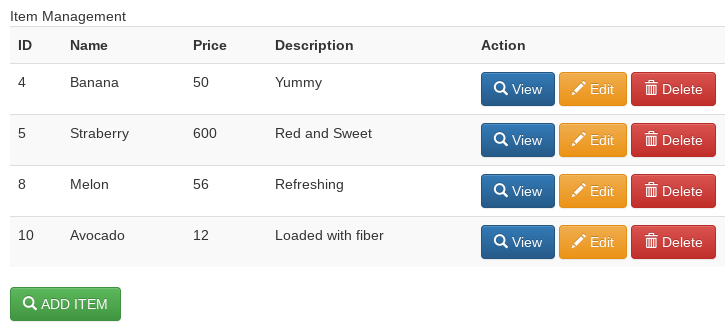
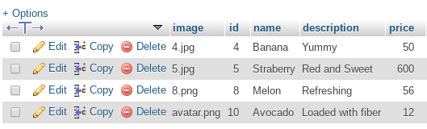

Every programmer has had to deal with CRUD functionality in most of their projects specially on applications that utilizes forms to retrieve and return data from a database. In one of our previous study group, we discussed how to create a simple app with CRUD functionality. [Download or clone the app here: https://github.com/mjdsunas/ciapp)] 

Below is the simple CRUD we created previously: 




It’s DB table look like this:



In this article, we will cover adding audit trail/log to our CRUD. Audit trails are implemented to maintain a record of system activity. This is to keep track of what changes were made to the database, and by whom. 

Implementing audit trail may be performed either by program code or database procedures/triggers.
We can start by by altering the DB table tblitem and add additional fields to implement the trail.

###Audit Trail implementation for CREATE

-Let’s add the following fields to tblitem to capture who added the record and when was the record added. 

```
added_by: int (11), allow NULL, default: NULL 
date_added: timestamp, allow NULL, default: NULL 
```
