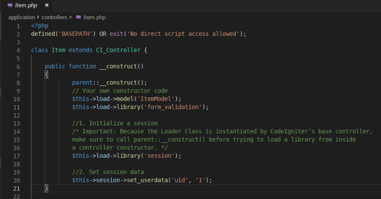
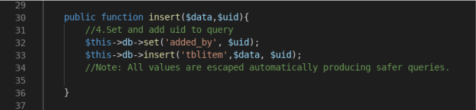
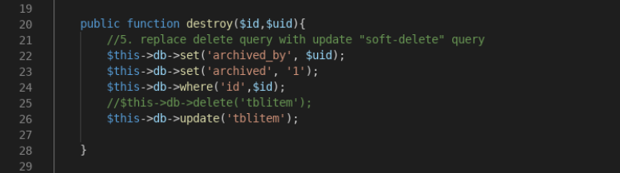
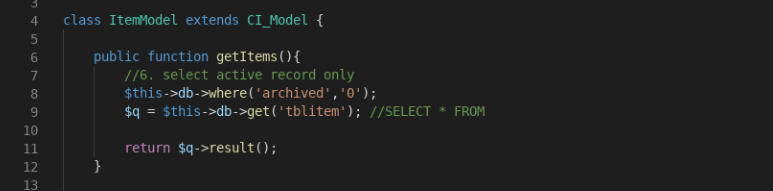
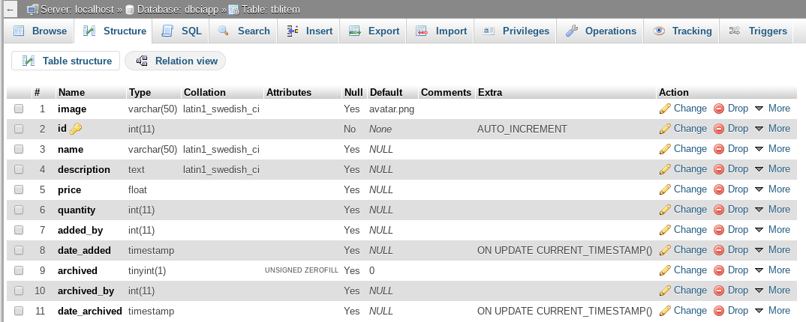
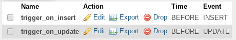
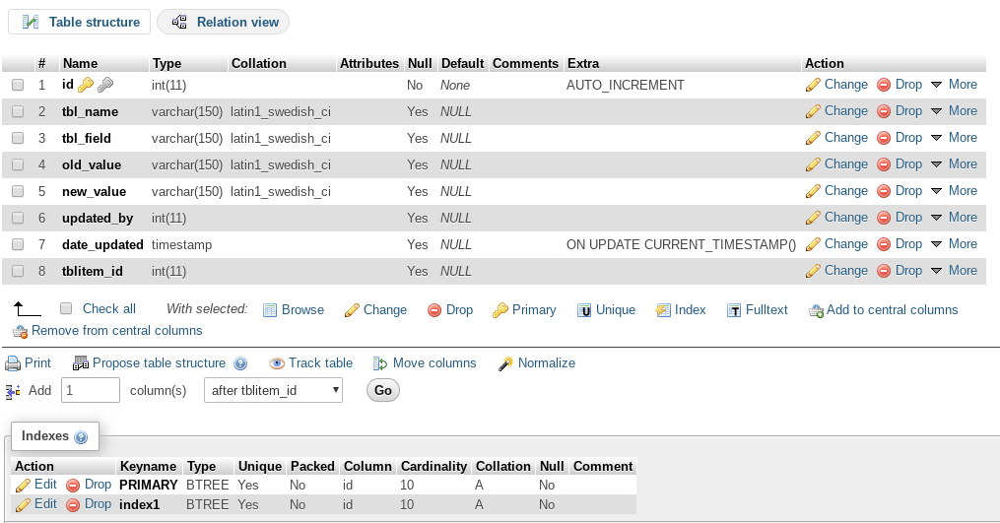
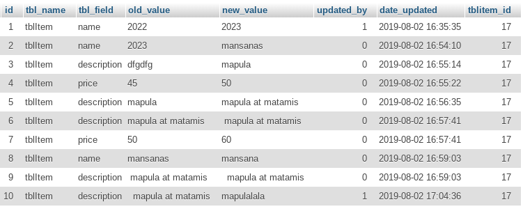
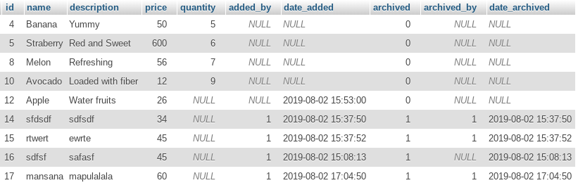

by: Mary Jeykle [https://github.com/mjdsunas]

Every programmer has had to deal with CRUD functionality in most of their projects specially on applications that utilizes forms to retrieve and return data from a database. In one of our previous study group, we discussed how to create a simple app with CRUD functionality. [Download or clone the app here: https://github.com/mjdsunas/ciapp] 

Below is the simple CRUD we created previously: 


It’s DB table look like this:


In this article, we will cover adding audit trail to our CRUD app. 

!>Audit trails are implemented to maintain a record of system activity. This is to keep track of what changes were made to the database, and by whom. 

Implementing audit trail may be performed either by program code or database procedures/triggers. We can start by altering the DB table **tblitem** and add additional fields to implement the trail.

## Audit Trail implementation for CREATE

1) Add the fields **added_by** and **date_added** to DB table **tblitem** to capture who added the record and when was the record added. 
```
added_by: int (11), allow NULL, default: NULL 
date_added: timestamp, allow NULL, default: NULL 
```
2) Add a trigger to capture the current date & time and update the date_added field with the current timestamp. Name the trigger **trigger_on_insert**
```
BEGIN
  SET NEW.date_added = CURRENT_TIMESTAMP;
END
```
3) Modify **Item controller** global constructor by getting the session data.



4) Add the session data to the **Item controller insert() function**.


5) Modify the **ItemModel insert() function** by setting and adding the session data to the insert query



Yeay! We just created an audit trail on who added the record and when was the record added. 

Now, test it! Try to add a new record in the CRUD application and check the DB table **tblitem** if the record was inserted and fields **added_by** and **date_inserted** was populated by the session id and current timestamp.

## Audit Trail implementation for DELETE

For delete operations, there are several ways to implement the trail depending on the data retention policy of the organization. Some organization do “hard delete” from the DB table and keep and deleted records to another DB table as archived tables. 

While other organization do “soft delete” by tagging the record “inactive” or “deleted” or “archived” and not showing it to the record list by filtering only the active records. 

Let’s try to do the “soft delete” approach.

1) Add the following fields to **tblitem** to capture if the record is deleted/inactive/archived,  who deleted the record and when was the record deleted.
```
archived: tinyint (1), allow NULL, default: 0 
archived_by: int (11), allow NULL, default: NULL 
date_archived: timestamp, allow NULL, default: NULL 
```
2) Add a trigger to capture the current date & time and update the **date_archived** field with the current timestamp. Name the trigger **trigger_on_update**
```
BEGIN

     IF NEW.archived = 1 THEN
          SET NEW.date_archived = CURRENT_TIMESTAMP;

     ELSEIF NEW.archived = 0 THEN
          SET NEW.date_archived = NULL;          
          SET NEW.archived_by = NULL;          
     END IF;

     END IF;
END
```
3) Update the **ItemModel destroy() function** by populating the **archived** and **archived_by** fields with the archived tag = ‘1’ and session id.    



4) In the **ItemModel getItems() function**, include a WHERE clause limiting the list with active records only. 



Yeay! We just created an audit trail on who deleted a record and when was the record deleted. 

Now, test it! Try to delete a record in the CRUD application and check the **tblitem** if the record’s **archived** field was updated with value ‘1’ and fields **archived_by** and **date_archived** was populated by the session id and current timestamp.

At this point, the DB structure of **tblitem** now look like this:



And added the following triggers:



## Audit Trail implementation for UPDATE

1) Create a new DB table **audit_trail** having the below table structure 



2) Update the **trigger_on_update** at DB table **tblitem** with the following script:
```
BEGIN

     IF NEW.archived = 1 THEN
          SET NEW.date_archived = CURRENT_TIMESTAMP;

     ELSEIF NEW.archived = 0 THEN
          SET NEW.date_archived = NULL;          
          SET NEW.archived_by = NULL;          

          IF NEW.name <> OLD.name THEN
               INSERT INTO audit_trail (tbl_name, tbl_field,old_value,new_value,updated_by,date_updated,tblItem_id) VALUES ('tblItem','name',OLD.name,NEW.NAME,NEW.added_by,CURRENT_TIMESTAMP,NEW.id);
          END IF;

          IF NEW.description <> OLD.description THEN
               INSERT INTO audit_trail (tbl_name, tbl_field,old_value,new_value,updated_by,date_updated,tblItem_id) VALUES ('tblItem','description',OLD.description,NEW.description,NEW.added_by,CURRENT_TIMESTAMP,NEW.id);
          END IF;

          IF NEW.price <> OLD.price THEN
               INSERT INTO audit_trail (tbl_name, tbl_field,old_value,new_value,updated_by,date_updated,tblItem_id) VALUES ('tblItem','price',OLD.price,NEW.price,NEW.added_by,CURRENT_TIMESTAMP,NEW.id);
          END IF;

     END IF;
END
``` 

We have implemented an audit trail during record update. We created an audit table that captures what was updated by logging the name of table and field updated, the old and new value of the record, who updated the data, and when was the data updated.   

Here is a the DB table audit_trail populated with data after update operation:



And DB table **tblitem** now looks like this:


