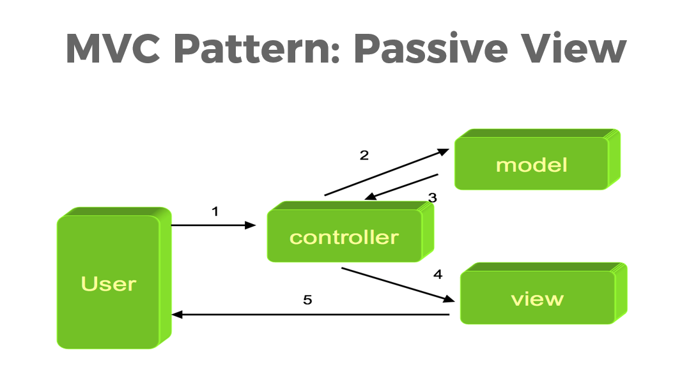

## PHP MVC

**MVC(Model-View-Controller**) is a **Design Pattern**. It **separates application logic from presentation**.

- **Model** - Part of the application that is responsible for retrieving data from the database.
- **View** - Front end of the application. Shows to the user the results of the operation.
- **Controller** - Orchestrates the operation. Handling and validating user input.

