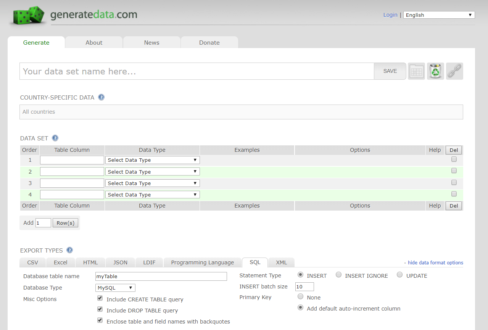
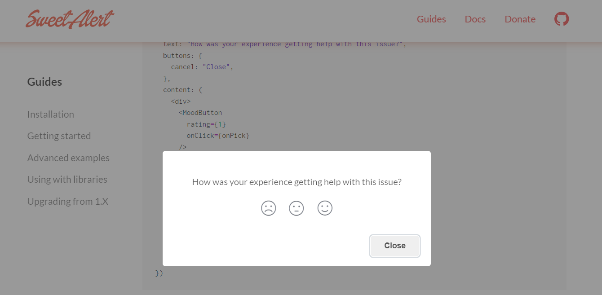
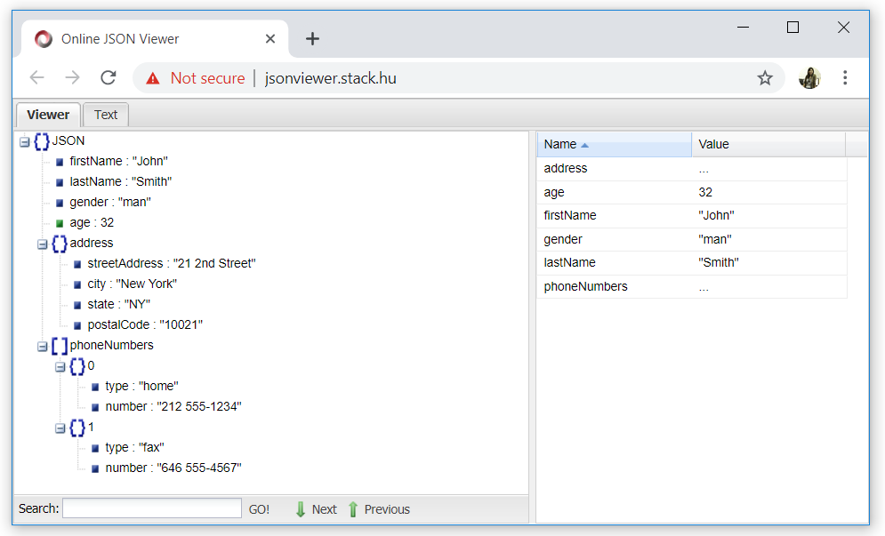
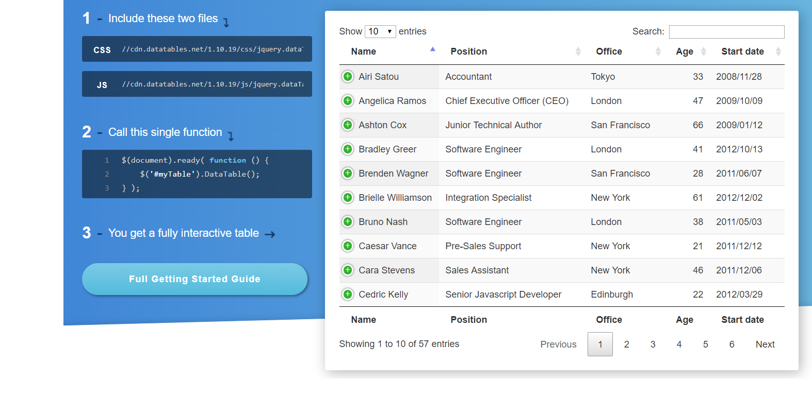

Development tools plays an important role in the entire web development process. They say, your web app is only as good as your dev tool(s)! So, it is important to choose and study your Dev Tools before jumping in to web development. As it wil save you both in time and financial resources.

To help you out, here are a list of essential tools for PHP web development to get you started. 

### Visual Studio Code
[https://code.visualstudio.com](https://code.visualstudio.com/)

Visual Studio Code is a lightweight but powerful source code editor which runs on your desktop and is available for Windows, macOS and Linux. It comes with built-in support for JavaScript, TypeScript and Node.js and has a rich ecosystem of extensions for other languages (such as C++, C#, Java, Python, PHP, Go) and runtimes (such as .NET and Unity). Begin your journey with VS Code with these [introductory videos](https://code.visualstudio.com/docs/getstarted/introvideos).


### CodeIgniter USER GUIDE
[https://www.codeigniter.com/user_guide](https://www.codeigniter.com/user_guide/)

If you are using CodeIgniter framework in your PHP projects, before trying to search for 'answers' in your coding problems in W3Schools or stackoverflow, try reading the CodeIgniter User Guide first. It is the primary documentation for CodeIgniter, included in the package downloads. The User Guide can also be read online. It contains an introduction, tutorial, a number of "how to" guides, and then reference documentation for the components that make up the framework.

### Data Generator
[http://generatedata.com](http://generatedata.com)

Ever needed custom formatted sample / test data, like, bad? Well, that's the idea of this script. It's a free, open source tool written in JavaScript, PHP and MySQL that lets you quickly generate large volumes of custom data in a variety of formats for use in testing software, populating databases, and... so on and so forth.

This site also offers an online demo where you're welcome to tinker around to get a sense of what the script does, what features it offers and how it works. Then, once you've whet your appetite, there's a free, fully functional, GNU-licensed version available for download. Alternatively, if you want to avoid the hassle of setting it up on your own server, you can donate $20 or more to get an account on the site, letting you generate up to 5,000 records at a time (instead of the maximum 100), and let you save your data sets. 



### Bootstrap Builder
[http://getbootstrap.com/docs/3.3/components](http://getbootstrap.com/docs/3.3/components/)

Bootstrap is the most popular HTML, CSS, and JS framework for developing responsive, mobile first projects on the web. This site give developers over a dozen of reusable components built to provide iconography, dropdowns, input groups, navigation, alerts, and much more. 

### Bootstrap Components Generator
[https://bootsnipp.com](https://bootsnipp.com)

Bootsnipp is an element gallery for web designers and web developers, anybody using Bootstrap will find this website essential in their craft. It is a free to use web service that provides code snippets for design elements on webpages. You can search for a particular webpage design element or simply browse them through the homepage. Clicking on an element opens its page where you can preview it and copy its code snippet. The code can be edited on the page and the preview is updated in real time.

You can then copy the code and use it in your projects if you are using Bootstrap HTML / CSS / JS.

### Sweet Alerts!
[https://sweetalert.js.org/guides](https://sweetalert.js.org/guides/)

SweetAlert makes popup messages easy and pretty. It is a beautiful replacement for success messages, error messages, warning modals, and a lot more. You can customize SweetAlert to fit your needs. 



### JSON Format viewer
[http://jsonviewer.stack.hu/](http://jsonviewer.stack.hu/)

JSON, short for JavaScript Object Notation, is a lightweight computer data interchange format. JSON is a text-based, human-readable format for representing simple data structures and associative arrays (called objects).

Example:

```
{
  "firstName": "John",
  "lastName": "Smith",
  "gender": "man",
  "age": 32,
  "address": {
    "streetAddress": "21 2nd Street",
    "city": "New York",
    "state": "NY",
    "postalCode": "10021"
  },
  "phoneNumbers": [
    {
      "type": "home",
      "number": "212 555-1234"
    },
    {
      "type": "fax",
      "number": "646 555-4567"
    }
  ]
}
```

This site convert JSON Strings to a Friendly Readable Format. Like this:



### DataTables
[https://www.datatables.net](https://www.datatables.net)

DataTables is a powerful jQuery plugin for creating table listings and adding interactions to them. It provides searching, sorting and pagination without any configuration. Help developers save time in creating advance and interactive HTML Tables.



### PHPMAKER: Rapid Application Development (RAD) Tool for PHP
[http://www.hkvstore.com/phpmaker](http://www.hkvstore.com/phpmaker)

PHPMaker is a powerful automation tool that can generate a full set of PHP quickly from MySQL, PostgreSQL, Microsoft Access, Microsoft SQL Server, Oracle and SQLite databases. Using PHPMaker, you can instantly create web sites that allow users to view, edit, search, add and delete records on the web. PHPMaker is designed for high flexibility, numerous options enable you to generate PHP applications that best suits your needs. The generated codes are clean, straightforward and easy-to-customize. The PHP scripts can be run on Windows servers or Linux servers (except Microsoft Access). PHPMaker can save you tons of time and is suitable for both beginners and experienced develpers alike.

### Make and receive phone calls and send and receive text messages using web service APIs
[https://www.twilio.com/](https://www.twilio.com/)

Twilio is a cloud communications platform as a service (CPaaS) company based in San Francisco, California. Twilio allows software developers to programmatically make and receive phone calls, send and receive text messages, and perform other communication functions using its web service APIs.

### Halt bots using reCAPTCHA
[https://www.google.com/recaptcha/intro/v3beta.html](https://www.google.com/recaptcha/intro/v3beta.html)

reCAPTCHA is a free service that protects your website from spam and abuse. reCAPTCHA uses an advanced risk analysis engine and adaptive CAPTCHAs to keep automated software from engaging in abusive activities on your site. It does this while letting your valid users pass through with ease.

reCAPTCHA offers more than just spam protection. Every time our CAPTCHAs are solved, that human effort helps digitize text, annotate images, and build machine learning datasets. This in turn helps preserve books, improve maps, and solve hard AI problems.

You can find a reCAPTCHA [codelab here](https://codelabs.developers.google.com/codelabs/reCAPTCHA/index.html#0).

### Google Charts for Data Visualization
[https://developers.google.com/chart/](https://developers.google.com/chart/)

Google Charts provides a perfect way to visualize data on your website. From simple line charts to complex hierarchical tree maps, the chart gallery provides a large number of ready-to-use chart types.

The most common way to use Google Charts is with simple JavaScript that you embed in your web page. You load some Google Chart libraries, list the data to be charted, select options to customize your chart, and finally create a chart object with an id that you choose. Then, later in the web page, you create a <div> with that id to display the Google Chart.

That's all you need to [get started](https://developers.google.com/chart/interactive/docs/quick_start).


### Web Audit Tool
[https://web.dev/measure](https://web.dev/measure)

Measure you website performance with this tool. It uses Lighthouse, is an open-source, automated tool for improving the quality of your web apps. It is integrated directly into the Chrome DevTools Audits panel. See your site's performance across the areas you care about. And get tips for improving your website.


