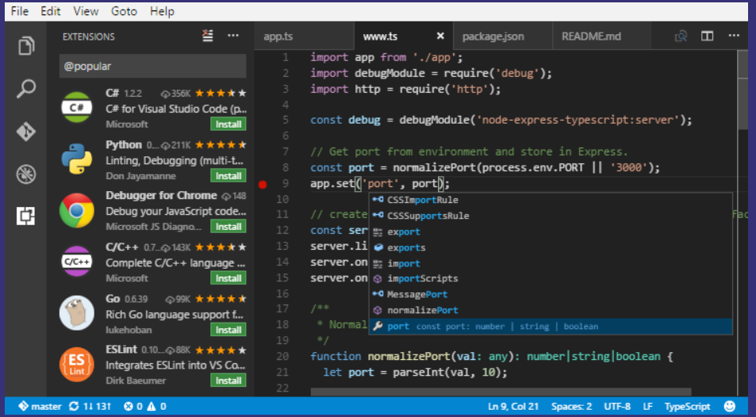

Development tools plays an important role in the entire web development process. They say, your web app is only as good as your dev tool(s)! So, it is important to choose and study your Dev Tools before jumping in to web development. As it wil save you both in time and financial resources.

To help you out, here are a list of essential tools for PHP web development to get you started. 

### VISUAL STUDIO CODE
[https://code.visualstudio.com](https://code.visualstudio.com/)

Visual Studio Code is a lightweight but powerful source code editor which runs on your desktop and is available for Windows, macOS and Linux. It comes with built-in support for JavaScript, TypeScript and Node.js and has a rich ecosystem of extensions for other languages (such as C++, C#, Java, Python, PHP, Go) and runtimes (such as .NET and Unity). Begin your journey with VS Code with these [introductory videos](https://code.visualstudio.com/docs/getstarted/introvideos).

### CodeIgniter USER GUIDE
[https://www.codeigniter.com/user_guide](https://www.codeigniter.com/user_guide/)

If you are using CodeIgniter framework in your PHP projects, before trying to search for 'answers' in your coding problems in W3Schools or stackoverflow, try reading the CodeIgniter User Guide first. It is the primary documentation for CodeIgniter, included in the package downloads. The User Guide can also be read online. It contains an introduction, tutorial, a number of "how to" guides, and then reference documentation for the components that make up the framework.

### DATA GENERATOR
[http://generatedata.com](http://generatedata.com)

### Bootstrap Builder
[http://getbootstrap.com/docs/3.3/components](http://getbootstrap.com/docs/3.3/components/)

### Bootstrap Components Generator
[https://bootsnipp.com](https://bootsnipp.com)

### Sweet Alerts!
[https://sweetalert.js.org/guides/](https://sweetalert.js.org/guides/)

### JSON Format viewer
[http://jsonviewer.stack.hu/](http://jsonviewer.stack.hu/)

### DataTables
[https://www.datatables.net](https://www.datatables.net)

### PHP RAD Tool: PHPMAKER
[http://www.hkvstore.com/phpmaker](http://www.hkvstore.com/phpmaker)

### Make and receive phone calls and send and receive text messages using web service APIs
[https://www.twilio.com/](https://www.twilio.com/)

### Sending email with gmail smtp with codeigniter email library
[https://stackoverflow.com/questions/1555145/sending-email-with-gmail-smtp-with-codeigniter-email-library](https://stackoverflow.com/questions/1555145/sending-email-with-gmail-smtp-with-codeigniter-email-library)

### Halt bots using reCAPTCHA
[https://www.google.com/recaptcha/intro/v3beta.html](https://www.google.com/recaptcha/intro/v3beta.html)

### Google Charts
[https://developers.google.com/chart/](https://developers.google.com/chart/)

### Web Audit Tool
[https://web.dev/measure](https://web.dev/measure)

