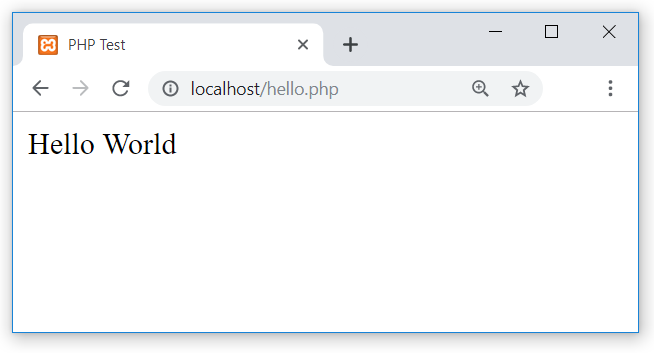

## Create your first PHP-enabled page

Create a file named ``hello.php`` and put it in your web server's root directory (``DOCUMENT_ROOT``) with the following content:

**Example #1 Our first PHP script: hello.php**


```<html>
 <head>
  <title>PHP Test</title>
 </head>
 <body>
 <?php echo '<p>Hello World</p>'; ?> 
 </body>
</html>
```

Use your browser to access the file with your web server's URL, ending with the /hello.php file reference. When developing locally this URL will be something like http://localhost/hello.php or http://127.0.0.1/hello.php but this depends on the web server's configuration. If everything is configured correctly, this file will be parsed by PHP and the following output will be sent to your browser:


```<html>
 <head>
  <title>PHP Test</title>
 </head>
 <body>
 <p>Hello World</p>
 </body>
</html>
```

This program is extremely simple and you really did not need to use PHP to create a page like this. All it does is display: Hello World using the PHP echo statement. Note that the file does not need to be executable or special in any way. The server finds out that this file needs to be interpreted by PHP because you used the ".php" extension, which the server is configured to pass on to PHP. Think of this as a normal HTML file which happens to have a set of special tags available to you that do a lot of interesting things.

If you tried this example and it did not output anything, it prompted for download, or you see the whole file as text, chances are that the server you are on does not have PHP enabled, or is not configured properly. Ask your administrator to enable it for you using the Installation chapter of the manual. If you are developing locally, also read the installation chapter to make sure everything is configured properly. Make sure that you access the file via http with the server providing you the output. If you just call up the file from your file system, then it will not be parsed by PHP. If the problems persist anyway, do not hesitate to use one of the many » PHP support options.

The point of the example is to show the special PHP tag format. In this example we used <?php to indicate the start of a PHP tag. Then we put the PHP statement and left PHP mode by adding the closing tag, ?>. You may jump in and out of PHP mode in an HTML file like this anywhere you want. For more details, read the manual section on the basic [PHP syntax](contents/php_fundamental.md).


