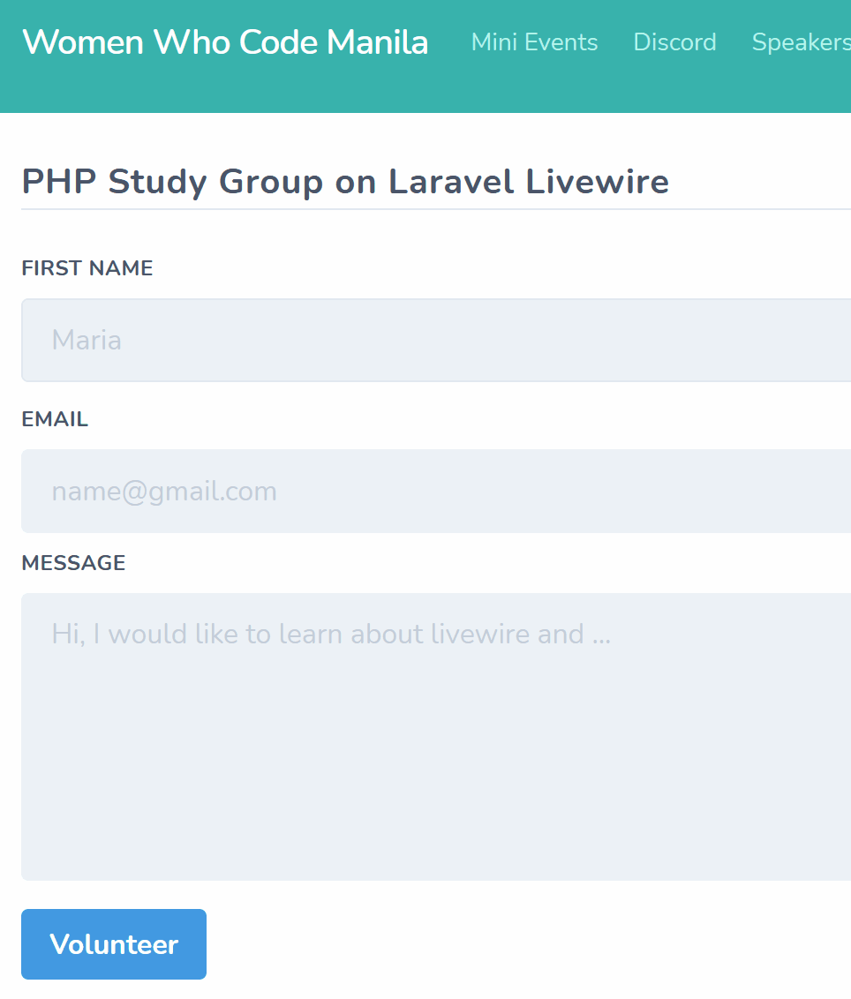

# Women Who Code Manila PHP Study Group - Livewire Edition

**Livewire** is a full-stack framework for Laravel that makes building dynamic interfaces simple, without leaving the comfort of Laravel.  Read more [here](https://laravel-livewire.com/).

## About this study group

We will study about Laravel Livewire by creating our first **contact form**. :)

Read this [document](wwcodemanila/study_groups.md) first to know what study groups are.

This study group is held once a month and is led by our volunteer leaders. However, everyone is welcome to join, learn, and share their knowledge in the community.

Everyone joining this study group and other Women Who Code events must follow our [code of conduct](https://github.com/WomenWhoCode/guidelines-resources/blob/master/code_of_conduct.md).

## Relevant links

- [Gitter Chat](https://gitter.im/WWCodeManila/PHP): Interact with the community. You can share something about Ruby, or ask help if you're stuck on a problem.
- [Github](https://github.com/wwcodemanila/WWCodeManila-PHP): View study group code
- [Meetup](https://bit.ly/wwcodemanilameetups): Get updated with the upcoming study group and other event schedules.
- [Facebook](https://facebook.com/wwcodemanila): Get updated about what's happening with the community.
- [Twitter](https://twitter.com/wwcodemanila): Get updates about current and future events.

## Helping out

### Volunteer

Attend one of our [events](https://bit.ly/wwcodemanilameetups) and talk to us! :smile:

### Donate

Even a little amount is a big help for us to achieve our mission of inspiring women to excel in tech careers. :heart:

You can donate at our [Open Collective](https://opencollective.com/wwcodemanila).

### Hosting

Do you want to host one of our study groups? Email us at **manila@womenwhocode.com**.

## Contributors

- Mary Jeykle Sunas ([@mjdsunas](https://github.com/mjdsunas))
- Karen Irene Cano ([@karenirenecano](https://github.com/karenirenecano))
